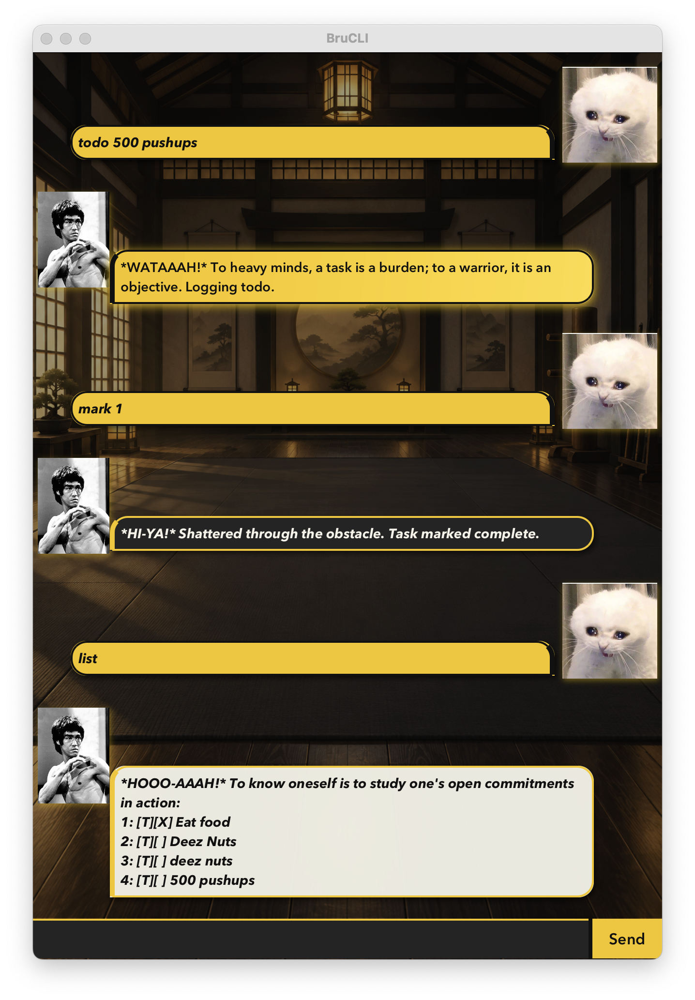

# BruCLI User Guide



Your deadlines have hands. BruCLI helps you fight back.

Welcome to the task-management dojo: add todos, track deadlines, schedule events, and knock out your backlog one command at a time. Be water, my friend. But please submit your assignment before midnight.

## Getting started

1. Launch BruCLI. The welcome message shows a few commands to try.
2. Type `todo Read a chapter` in the input box, then press **Enter** or click **Send**.
3. Enter `list` to see your tasks.
4. Enter `mark 1` when you finish the first task.
5. Enter `help` whenever you need the command guide.

Tasks are saved automatically after additions, completion changes, and deletions. BruCLI loads them again when you restart from the same working directory.

## Command basics

- Replace uppercase placeholders such as `DESCRIPTION` and `NUMBER` with your own values. Do not type the placeholders literally.
- Command words are case-insensitive: `help`, `HELP`, and `Help` work. Use lowercase markers `/by`, `/from`, and `/to` exactly as shown.
- Dates and times use `yyyy-MM-dd HHmm`, with a 24-hour clock: `2026-09-30 1800` means 30 September 2026 at 6 pm.
- Task numbers start at **1**. Use the numbers shown by `list` or `find`; run `list` again after deleting a task because later numbers change.
- `[T]` means todo, `[D]` means deadline, and `[E]` means event. `[ ]` means incomplete; `[X]` means complete.

BruCLI randomizes many greetings and confirmations. The outputs below are possible responses; yours may have different wording or a different battle cry. Task-list examples omit the randomized introductory line. Terminal output also adds a `BruCLI |` prefix.

## Adding todos

Add a task that does not need a date.

**Usage:** `todo DESCRIPTION`

**Example:** `todo Read a chapter`

BruCLI adds an incomplete todo and saves it. A possible response is:

```text
*HI-YA!* A goal is not always meant to be reached, it often serves simply as something to aim at. Task added.
```

If this is your first task, `list` will include:

```text
1: [T][ ] Read a chapter
```

## Adding deadlines

Add a task with a due date and time. Include `/by` before the date.

**Usage:** `deadline DESCRIPTION /by yyyy-MM-dd HHmm`

**Example:** `deadline Submit assignment /by 2026-09-30 1800`

BruCLI saves the deadline. A possible response is:

```text
*HI-YA!* Time waits for no process. Deadline anchored.
```

After the todo above, `list` will include:

```text
2: [D][ ] Submit assignment (by: Sep 30 2026, 6:00 PM)
```

## Adding events

Add an activity with a start and end time. Put `/from` before the start and `/to` before the end, and include a full date for both.

**Usage:** `event DESCRIPTION /from yyyy-MM-dd HHmm /to yyyy-MM-dd HHmm`

**Example:** `event Study group /from 2026-09-30 1400 /to 2026-09-30 1600`

BruCLI saves the event. A possible response is:

```text
*HI-YA!* A warrior moves with rhythm, not chaos. Event locked.
```

After the two tasks above, `list` will include:

```text
3: [E][ ] Study group (from: Sep 30 2026, 2:00 PM to: Sep 30 2026, 4:00 PM)
```

## Listing tasks

Show all tasks, including completed ones.

**Usage and example:** `list`

After adding the three examples above, the task rows are:

```text
1: [T][ ] Read a chapter
2: [D][ ] Submit assignment (by: Sep 30 2026, 6:00 PM)
3: [E][ ] Study group (from: Sep 30 2026, 2:00 PM to: Sep 30 2026, 4:00 PM)
```

An empty list produces:

```text
The path is clear—no tasks match your request.
```

## Filtering tasks by date

Show deadlines and events relative to a date and time. Todos are excluded because they have no date. Deadlines are compared by their due time; events are compared by their **start time**.

**Usage:** `list BEFORE yyyy-MM-dd HHmm` or `list AFTER yyyy-MM-dd HHmm`

- `BEFORE` includes tasks **at or before** the given time.
- `AFTER` includes tasks **strictly after** the given time.

**Example:** `list BEFORE 2026-09-30 1400`

Using the three example tasks, this includes the event starting exactly at 2 pm:

```text
3: [E][ ] Study group (from: Sep 30 2026, 2:00 PM to: Sep 30 2026, 4:00 PM)
```

**Example:** `list AFTER 2026-09-30 1400`

This includes the deadline, but not the event starting exactly at the boundary:

```text
2: [D][ ] Submit assignment (by: Sep 30 2026, 6:00 PM)
```

Filtered results keep their original task numbers.

## Finding tasks

Search descriptions for text, ignoring letter case. Partial matches work, and multiple words are treated as one search phrase.

**Usage:** `find KEYWORD`

**Example:** `find ASSIGN`

Using the example tasks, the response is:

```text
Focus reveals the target. Here are the matching tasks:
2: [D][ ] Submit assignment (by: Sep 30 2026, 6:00 PM)
```

Results retain their original task numbers. If nothing matches, the response includes `The path is clear—no tasks match your request.`

## Marking tasks as done

Complete a task using its displayed number. The task stays in the list.

**Usage:** `mark NUMBER`

**Example:** `mark 1`

A possible response is:

```text
*HI-YA!* Strike complete! Task conquered.
```

The next `list` shows:

```text
1: [T][X] Read a chapter
```

## Reopening tasks

Change a completed task back to incomplete.

**Usage:** `unmark NUMBER`

**Example:** `unmark 1`

A possible response is:

```text
*HI-YA!* The opponent rises again; face it with renewed energy. Task reopened.
```

The next `list` shows:

```text
1: [T][ ] Read a chapter
```

## Deleting tasks

Remove a task and save the updated list. Deletion happens immediately, without a confirmation prompt or an undo command.

**Usage:** `delete NUMBER`

**Example:** `delete 1`

A possible response is:

```text
*HI-YA!* Stripped away the unnecessary. Erased!
```

After deleting the todo from the three-task example, `list` shows the remaining tasks with new numbers:

```text
1: [D][ ] Submit assignment (by: Sep 30 2026, 6:00 PM)
2: [E][ ] Study group (from: Sep 30 2026, 2:00 PM to: Sep 30 2026, 4:00 PM)
```

## Getting help

Display supported commands, placeholder explanations, and date examples without changing your tasks.

**Usage and example:** `help`

The response begins with:

```text
BruCLI command guide

todo DESCRIPTION - add a task
deadline DESCRIPTION /by yyyy-MM-dd HHmm - add a deadline
event DESCRIPTION /from yyyy-MM-dd HHmm /to yyyy-MM-dd HHmm - add an event
```

The full response also covers listing, filtering, searching, completion, deletion, and the commands below.

## Taking a tiny motivation break

Get a random playful message. This does not launch an interactive game or change your tasks.

**Usage and example:** `game`

A possible response is:

```text
*HI-YA!* Your opponent is procrastination. Round one begins now.
```

## Asking for ultimate power

Try `sudo` for a joke response. It does not run another command or grant administrator privileges.

**Usage and example:** `sudo`

```text
Power without discipline is no power at all. Sudo is unavailable.
```

## Saying goodbye

**Usage and example:** `bye`

A possible response is:

```text
*HI-YA!* Be water, my friend... until the next execution.
```

In the terminal app, this ends the session. In the graphical app, it displays the goodbye message; close the window to exit. Task changes have already been saved as you make them.

## Fixing common input errors

| Problem | What to do |
|---|---|
| Empty description | Include text after `todo`, `deadline`, or `event`. |
| Missing date marker | Use `/by` for deadlines and `/from` followed by `/to` for events. |
| Invalid date or time | Use a real date and four-digit time, such as `2026-09-30 0930`. |
| Invalid task number | Run `list`, then choose a displayed positive whole number. |
| Empty search | Add text after `find`. |
| Unknown command | Enter `help` to check the supported commands. |

For example, `todo` without a description returns:

```text
A strike needs a target. Usage: todo DESCRIPTION
```

Tasks are stored in `tasks.txt` in the directory from which BruCLI runs. If saving fails, BruCLI reports it; check that this directory is writable. Launch from the same directory next time to load the same task file.
